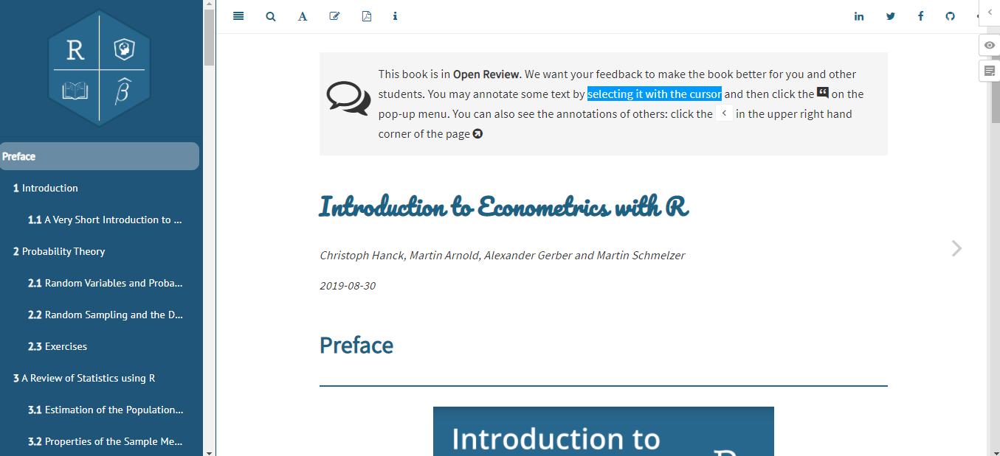

```{r, echo=FALSE}
knitr::opts_chunk$set(cache=TRUE, comment="#", fig.retina=2, crayon.enabled = TRUE, dpi=600)
# set.seed(15)
library(knitr)
# library(stats)
# library(kableExtra)
# library(formattable)
# library(ggplot2)
# library(ggthemes)
# library(ggExtra)
# library(dplyr,warn.conflicts = FALSE)
# library(animation)
# library(gifski)
# library(latex2exp)
# library(tikzDevice)
```

```{css, echo=F}
.remark-slide table, .remark-slide table thead th {
  border-top: 0px;
  border-bottom: 0px;
  padding:0px;
}
.remark-slide table thead th[style] {
  padding-left: 0px !important;
  padding-right: 0px !important;
}

.remark-slide thead tr th, .remark-slide tr:nth-child(2n){
  background: LightCyan;
}

table thead tr:empty{
  visibility: hidden;
}

strong, b {
    color: DarkBlue;
}

.footnote {
    font-size: 80%;
    bottom: 0.5em;
    color: #c8e10b;
}

.remark-slide-content {
    padding: 1em 2em 1em 2em;
}

.DataTable tr:nth-child(2n){
    background-color: white !important;
}


.latex-macros{
  display: none;
}
```

<div class="latex-macros">

$$\require{color}$$
$$\definecolor{purple}{RGB}{226, 15, 233}$$
$$\definecolor{grey}{RGB}{177, 159, 149}$$

</div>


## Outline

- ### Examples

- ### Intall Tools

- ### Write book in R markdown

- ### Build book using the bookdown package

- ### Publish through GitHub

---
class: middle center

# Examples

---

## [Bookdown Book Examples](https://bookdown.org/)

.center[
  .pull-left[
    [
      
    ](https://desautm.github.io/calcul3/geogebra-fctvar.html)
  ]
  .pull-right[
    [
      
    ](https://jonathanweisberg.org/vip/)
  ]
]

.center[
  .pull-left[
    [
      
    ](https://www.econometrics-with-r.org/)
  ]
  .pull-right[
    [
      
    ](https://ex4calc.netlify.com/applications-derivatives.html#optimization-problems)
  ]
]

---
class: middle center

# Tools

---

## Reference Books and Tools

- [Pandoc: a universal document converter](https://pandoc.org/getting-started.html)

- [bookdown: Authoring Books and Technical Documents with R Markdown](https://bookdown.org/yihui/bookdown/)

- [Rstudio](https://rstudio.com/products/rstudio/download/)

- The bookdown package and other related packages

- [GitHub Desktop](https://desktop.github.com/)

---

## Install `R`, `Rstudio` and Packages

- Install `R` and `Rstudio`

  Go to [R project website](https://cran.r-project.org/) and [Rstudio website](https://rstudio.com/products/rstudio/download/) download the latest version of R and Rstudio Desktop.

  ***Tip:*** It's better to install R to a different location instead of the default location, such as `C:\Program Files\R` on windows.

- Install `R` Packages

  Type in the command `install.packages("bookdown")` in the Rstudio console and hit enter, or go to `Tools->Install Packages` to find and install a package.

  ***Tips:*** Don't install packages to the default local repository. Instead, create a `.Renviron` file to your home directory `~/` manually or using the function `file.edit('~/.Renviron')`, then add the library path `R_LIBS_USER="path"` to .Renviron, for example, `R_LIBS_USER="~/Rpackages"`.

---
class: middle center

# Write

---

## Create a Bookdown Book Project Folder

- Bookdown can be used to create books in pdf, html, epub and other format.

- To create a new bookdown project (folder) you may go to `File->New Project->New Directory` and choose `Book project using bookdown`. Or you can download an example book from [github.com](https://github.com/rstudio/bookdown) or other places.

.center[
  
]

---

## Modify the YAML files `_output.yml` and `_output.yml`

- YAML is a data-serialization language which is normally used to store configuration information.
- `_output.yml` mainly controls the output styles.
- `_bookdown.yml` mainly defines what files to process and their order.

.pull-left[
  .center[
<iframe src="Examples/output.yml" width="540" height="320"></iframe>
```{r output-yml, echo=FALSE}
xfun::embed_file("Examples/_output.yml")
```
]
]

.pull-right[
  .center[
  <iframe src="Examples/bookdown.yml" width="540" height="320"></iframe>
  ```{r bookdown-yml, echo=FALSE}
  xfun::embed_file("Examples/_bookdown.yml")
  ```
]
]

---

## Writing the Book via R Markdown

- `Markdown` is a free markup language with simple formatting syntax. `R markdown` extends `markdown` with the support of the `R` programing language.

- Some features of Markdown

  - Headers can be declared using `#` in markdown.

  - For *italics text*, wrap the text with one star `*` or underscore `_` on each side: `*one star on each side*`.
  - For **bold text**, wrap the text with two stars `**` or underscores `__` on each side: `**two stars on each side**`.
  - Use the syntax `[Link Name](url)` to create a hyperlink.
  - Use the syntax `` to add an image.

- For more features, see Section [2.5 Markdown syntax](https://bookdown.org/yihui/rmarkdown/markdown-syntax.html) in the book [R Markdown: The Definitive Guide](https://bookdown.org/yihui/rmarkdown/).

---
class: middle center

# Build

---

## Build the Book

- Open the file with `.Rproj` as its file type in your bookdown project folder in `Rtudio`.
  - Option 1: In RStudio, the `Build` menu, click `build all` (or `Install and Restart` if not initial build.).
  - Option 2: In the upper right panel, click `Build Book` or choose an output format to build. The output formats are defined in the YAML file `_output.yml`
  - Option 3: If an .Rmk file was open, you will see the `Knit` button on the top of upper left panel which can be used build an individual chapter.
  
.center[

]

---
class: middle center

# Publish

---

## `Git` and `GitHub`

- What is it?
  - `Git` is an Open Source Distributed Version Control System.
  - `GitHub` is a code hosting platform for version control and collaboration.

- Setup

  - Create a free account on [GitHub.com](https://github.com/).

  - [Download and Install `git`](https://git-scm.com/downloads) and then install it to you computer.

  - Dowland and install [Github Desktop](https://desktop.github.com/) or other [git GUI Clients](https://git-scm.com/download/gui/windows).

- Introductory articles on Git
  - [git - the simple guide](https://rogerdudler.github.io/git-guide/)
  - [An introduction to Git: what it is, and how to use it](https://www.freecodecamp.org/news/what-is-git-and-how-to-use-it-c341b049ae61/).

---

## Basic Usage of GitHub and The Client

- You may create and manage your repositories on github.com or use the Github Desktop app. The following are frequently used actions: `init`, `commit`, `push`, and `fetch`.

  - `init` creates an new repository.
  - `commit` updates changes to local computer.
  - `push` sends updated local changes to the server.
  - `fetch` downloads newer changes on server to local computer.

  <!-- - `clone` download a repository from [Github](https://github.com/) to local computer. -->

<!-- - Collaboration on github.com is easy. -->

<!--   - `fork` saves a copy of a public repository to your own account. -->
<!--   - `pull request` lets you tell others about changes you pushed to a branch in a repository that you cloned on [Github](https://github.com/). -->

<!-- .blue[**Tip:**] `pull request` can be useful for others to submit corrections to your book if you have a public repository for your book project on [Github](https://github.com/). -->

- Create an new repository within your bookdown project folder, then commit and push (publish in Github Desktop App) to github.com.
.center[

]


---

## Publish a Book via Github Pages or Netlify

- To use Github Pages, first you need to create a GitHub repository named `username.github.io`. It can be an empty repository, it can also be a full personal website.

- To publish your project site via GitHub Pages, log on to github.com and then change the `GitHub Pages Sources settings` for your reporitory. To let Github automatically publish the project site, the branch should be names as `gh-pages`, and the folder should be named as `docs`.
.center[

]


- More details can be found in [Configuring a publishing source for your GitHub Pages site](https://help.github.com/en/github/working-with-github-pages/configuring-a-publishing-source-for-your-github-pages-site).

- For a free account, only public repositories can be published via Github pages. To publish a private repository, it is recommended to use [Netlify](www.netlify.com). Please read [the blogdown book section 3.1](https://bookdown.org/yihui/blogdown/netlify.html) for instructions.

---
class: middle center

# .blue[Thank You!]
